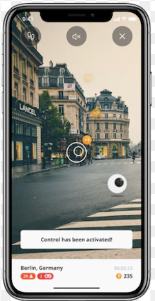

# SE4020 - Assignment 02 - VisionOS App

Please go under edit and edit this file as needed for your project.  There is no seperate documentation needed.

# Project Name - 
# Student Id - 
# Student Name - 

#### 01. Brief Description of Project - 
#### 02. Users of the System - 
#### 03. What is unique about your solution -
#### 04. Briefly document the functionality of the screens you have (Include screen shots of images)
e.g. The first screen is used to capture a photo and it will be then processed for identifying the landmarks in the photo.

  

#### 05. Learning Reflection (What you learnt doing this assignment)

#### 06. UI Components used

e.g. The following components were used in the Landmark Identify App, UIButton, UIAlert, UIViewController, UINavigationController

#### 07. Documentation 

(a) Design Choices

(b) Implementation Decisions

(c) Challenges

#### 08. Reflection

Challenges that you faced in doing the assingment (other than know technical issues of getting hold of a proper Mac machine).
How would have approached this Assignment differently

  

