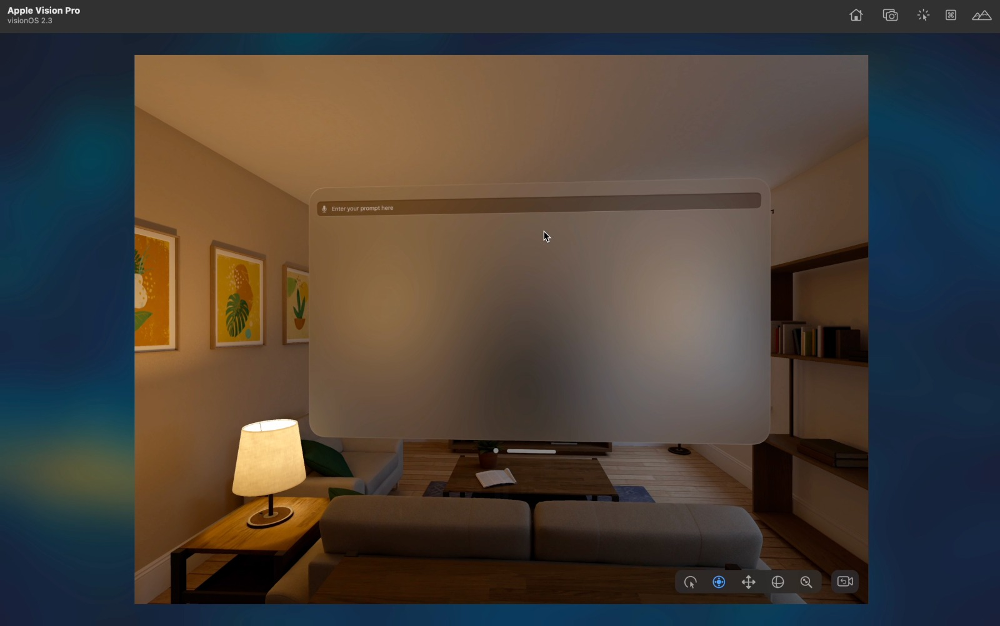
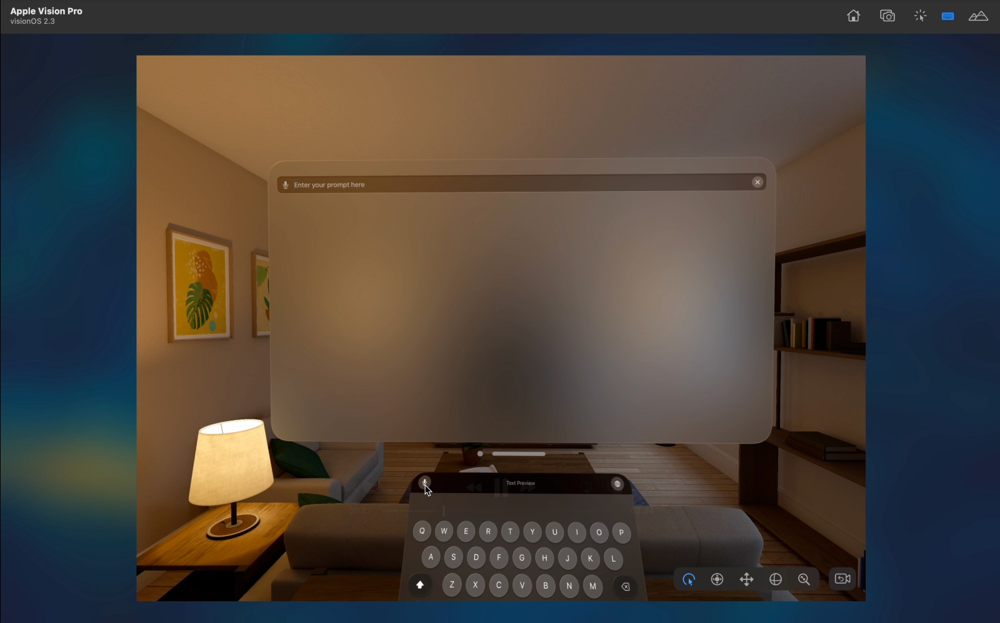
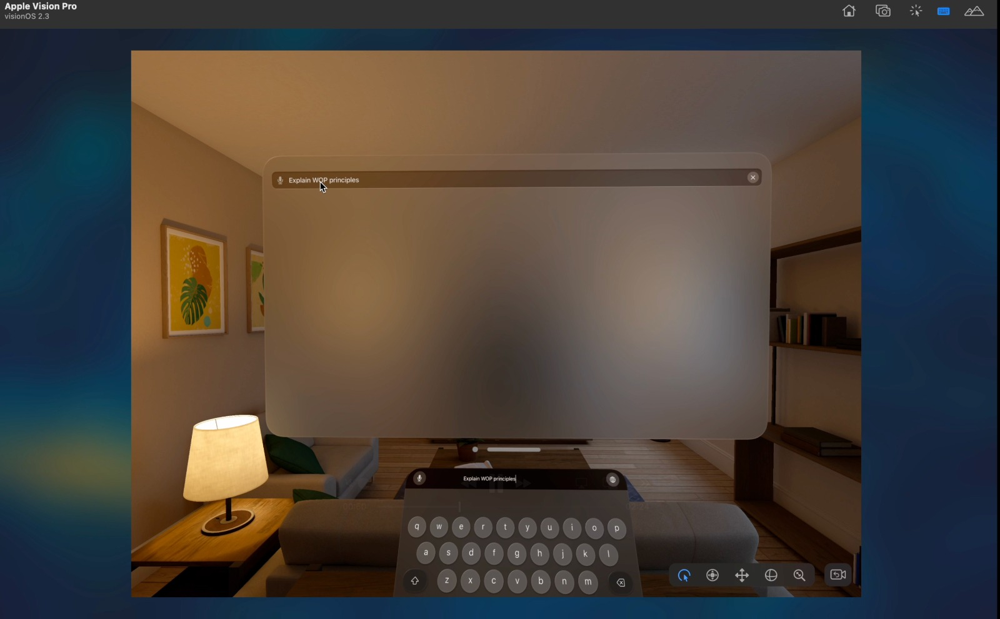
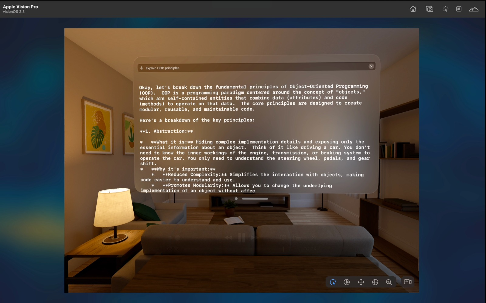

# ChatWithGemini - VisionOS App

#### 01. Brief Description of Project
ChatWithGemini is a visionOS app built in SwiftUI that embeds Google’s Gemini 2.0 Flash model into an immersive spatial-computing environment. Users speak or type queries into a floating search bar; the app sends them to Gemini via HTTPS, parses the JSON response, and renders the reply with a typewriter animation. Under the hood it leverages RealityKitContent (from a Reality Composer scene package) to prepare for future 3D/AR extensions, while the core chat UI lives in a SwiftUI window group.

#### 02. Users of the System
- VisionOS End-Users: Owners of Apple Vision Pro headsets wanting an on-device, hands-free chat assistant.
- Developers & Designers: Those exploring integration of LLMs into spatial apps.
- Accessibility-Focused Users: People who benefit from voice-driven conversational interfaces in mixed reality.

#### 03. What is unique about your solution
- Typewriter Effect for Replies: Utilizes a custom TypewriterText view to animate Gemini’s responses character-by-character, enhancing engagement.
- UIKit–SwiftUI Bridging: Implements a UIViewRepresentable SearchBar to deliver a familiar, feature-complete search interface within SwiftUI.
- Modular Secrets Management: Separates API keys into a Secrets.swift file (and example template) to keep credentials out of source control

#### 04. Briefly document the functionality of the screens you have (Include screenshots of images)
Main Chat Screen
  

Floating Search Bar with Text and Voice Input
  

  

Response displays shows the output of Gemini’s completion API in a vertically scrollable view, revealing text incrementally.
  

#### 05. Learning Reflection (What you learnt doing this assignment)
- Learning and playing around with RealityKit and VisionOS was fascinating to see the simluator run was amazing to see!
- Custom View Animations: Building a reusable TypewriterText with Timer.publish to control reveal speed and lifecycle.
- Project Organization for VisionOS: Structuring an Xcode multiplatform project that imports RealityKitContent packages in preparation for 3D/AR integration.

#### 06. UI Components used
- VStack, ScrollView, Text (SwiftUI)
- Custom Views: SearchBar (UIViewRepresentable), TypewriterText (animated Text)
- Helper Files: Secrets.swift / Secrets.swift.example for API key management

#### 07. Documentation 

(a) Design Choices
- SwiftUI First: Chosen for rapid prototyping of UI and state management.
- RealityKit Content: Pre-imported to layer in 3D scenes without refactoring later.
- Typewriter Animation: Selected to mimic “live” typing and improve user engagement.
- Secrets Template: Provided an example file to encourage secure handling of keys.

(b) Implementation Decisions
- URLSession + Codable: Standard Apple frameworks for LLM API calls and response parsing.

(c) Challenges
- Running the simulator in the Mac caused issues due to lack of proper resources.
- VisionOS Simulator Timeouts: Initial Error while searching for Xcode SDK: timed out due to misconfigured scheme.

#### 08. Reflection
API Key Security: Storing keys in plain Swift files felt brittle. Next time, I’d integrate Keychain or Apple’s .xcconfig environment variables.

  

